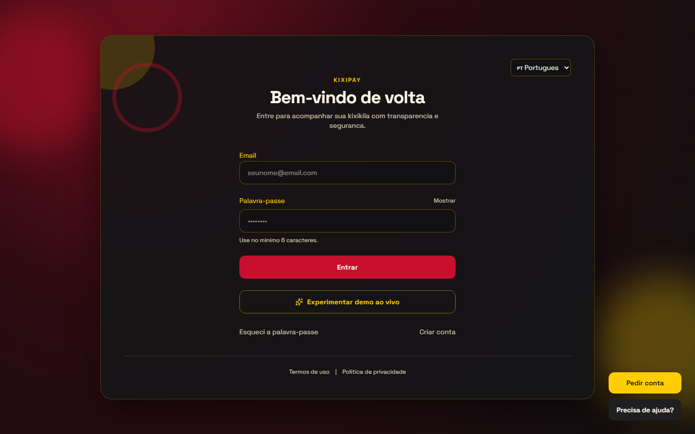
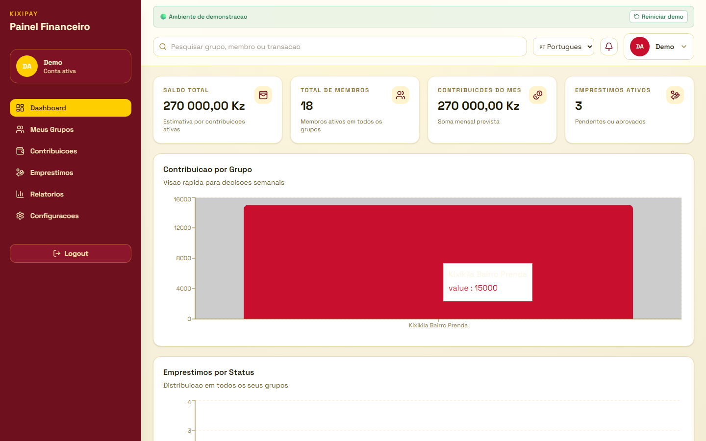
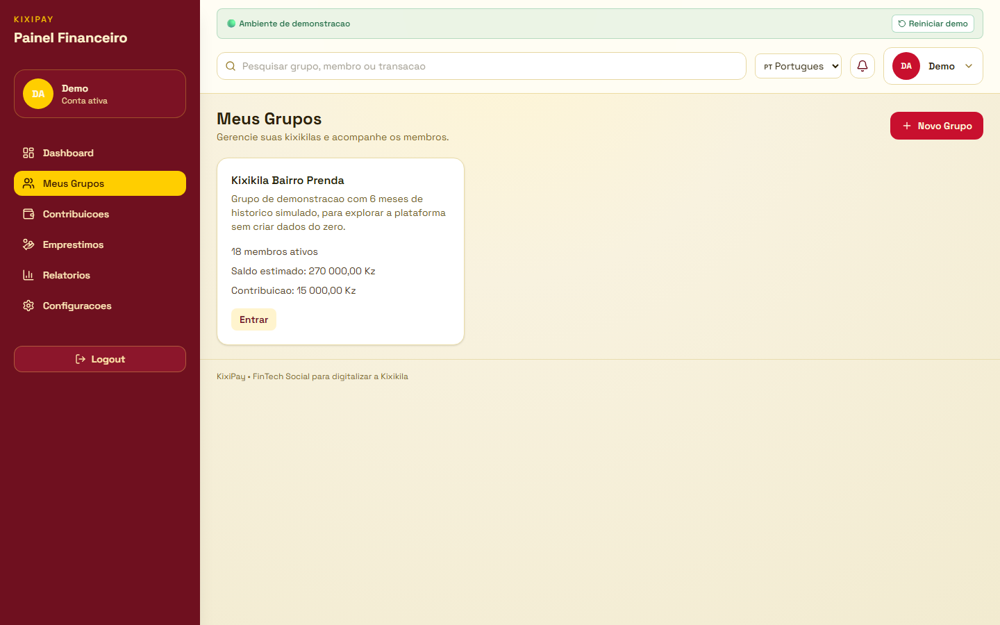
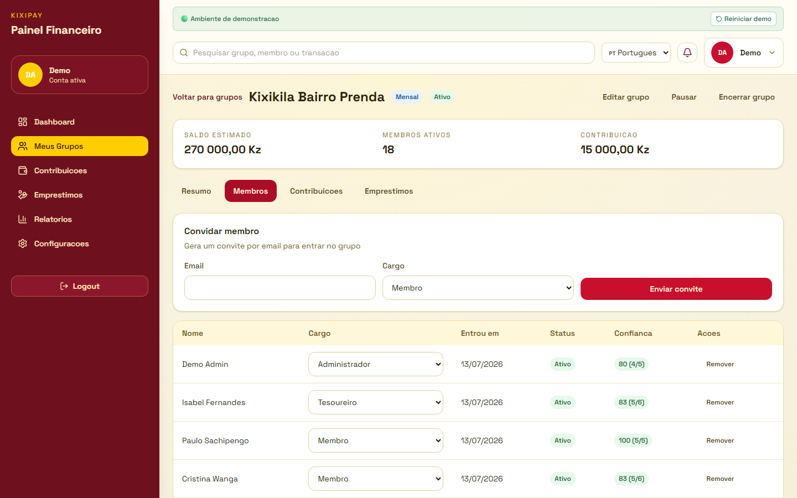
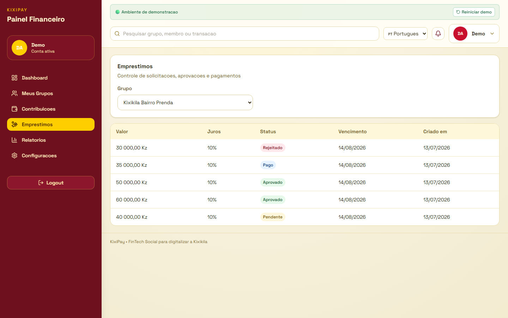
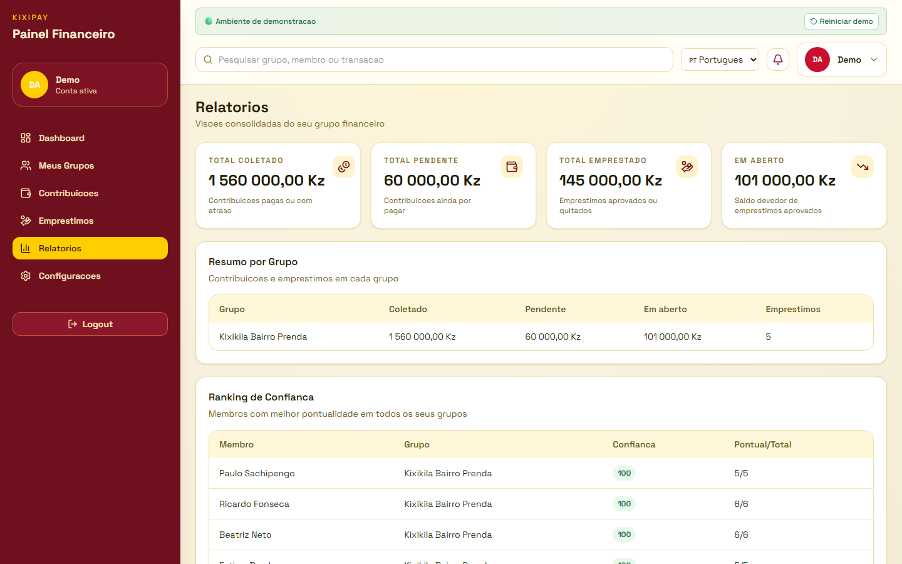
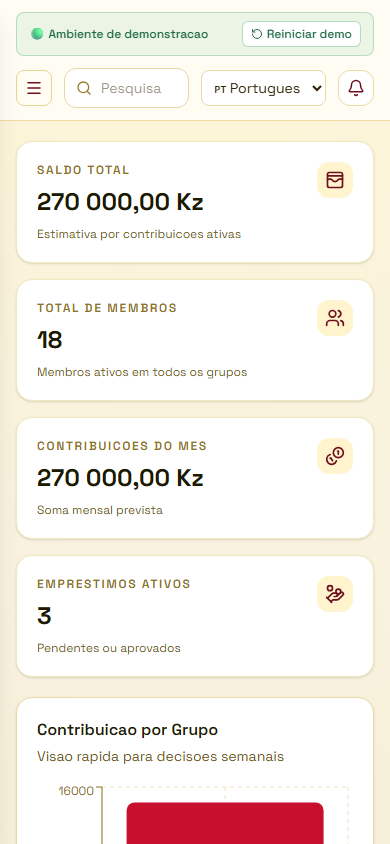

# KixiPay

> A Social FinTech that digitizes Kixikilas (community savings groups), improving transparency, trust, and financial inclusion.

🌍 **Live Demo:** Soon

## Screenshots

| Landing / Login | Dashboard |
| --- | --- |
|  |  |

| Groups | Members & Trust Score |
| --- | --- |
|  |  |

| Loans | Reports |
| --- | --- |
|  |  |

| Mobile |
| --- |
|  |

## The Problem

Community savings groups (Kixikilas) are often managed manually using notebooks and messaging apps.

This leads to:

- Lost records
- Human errors
- Lack of transparency
- Fraud
- Difficulties accessing formal financial services

## The Solution

KixiPay digitizes community savings groups by providing:

- Group management
- Member management
- Contributions
- Loans
- Trust Score
- Reports
- Secure authentication

## Features

- ✅ JWT Authentication
- ✅ Secure Password Hashing (bcrypt)
- ✅ User Registration
- ✅ Password Recovery
- ✅ Group Management (create, edit, pause/reactivate/close)
- ✅ Member Management (roles, invitations, last-admin lockout protection)
- ✅ Contribution Tracking
- ✅ Loan Management (request, approve/reject, repayment)
- ✅ Trust Score (punctuality-based, recalculated automatically)
- ✅ Consolidated Dashboard & Reports
- ✅ One-Click Live Demo Mode (auto-seeded, self-resetting)
- ✅ Internationalization (PT / EN / ES / FR)
- ✅ Responsive Design
- ✅ Automated Tests

## Architecture

```
Next.js (client)
        ↓
Express API
        ↓
Prisma ORM
        ↓
PostgreSQL (Supabase)
```

## Tech Stack

| Layer | Technology |
| --- | --- |
| Frontend | Next.js, React |
| Backend | Node.js, Express |
| ORM | Prisma |
| Database | PostgreSQL (Supabase) |
| Authentication | JWT |
| Styling | Tailwind CSS |
| Language | TypeScript |
| Testing | Vitest |
| Deployment | Railway (web + API) + Supabase |

## Project Structure

```
kixipay/
├─ apps/
│  ├─ web/       # Next.js frontend
│  └─ api/       # Express backend
├─ packages/
│  ├─ ui/
│  ├─ types/
│  └─ utils/
├─ docs/         # Product & architecture docs, deploy checklist, dev log
├─ prisma/       # Schema, migrations, seed
├─ database/     # DB notes / auxiliary SQL
├─ scripts/      # One-off tooling (e.g. migration fallback)
└─ assets/       # Screenshots and other static assets
```

## Getting Started

```bash
git clone https://github.com/LeonardoNkuba/kixipay.git
cd kixipay
npm install
cp .env.example .env
npm run prisma:migrate
npm run prisma:seed
npm run dev
```

- Web: http://localhost:3000
- API: http://localhost:3333
- Health check: http://localhost:3333/health

## Environment Variables

```
DATABASE_URL=
DIRECT_URL=
JWT_SECRET=
```

`apps/web` also needs `NEXT_PUBLIC_API_URL` when deployed (it falls back to `http://localhost:3333/api` otherwise). Never commit real values — see `.env.example` for the format.

## Try the Live Demo

1. Visit [kixipay.up.railway.app](https://kixipay.up.railway.app)
2. Click **Experimentar demo ao vivo** ("Try live demo")
3. You're in — a pre-populated group with 18 members and 6 months of history, no registration required

A "Reset demo" button in the header (visible only on the demo account) restores the sample data at any time.

## Roadmap

- Push notifications
- QR payments
- Mobile app
- AI fraud detection
- Credit scoring
- Banking integration

## Team

**Leonardo Nkuba**

- Backend
- Frontend
- Architecture
- Database
- Deployment

## Documentation

- `docs/vision.md`
- `docs/mvp-features.md`
- `docs/premium-features.md`
- `docs/architecture-stack.md`
- `docs/data-model.md`
- `docs/roadmap-7-days.md`
- `docs/deploy-checklist.md`
- `docs/development-log.md` — day-by-day build log

## License

MIT — see [LICENSE](LICENSE).
